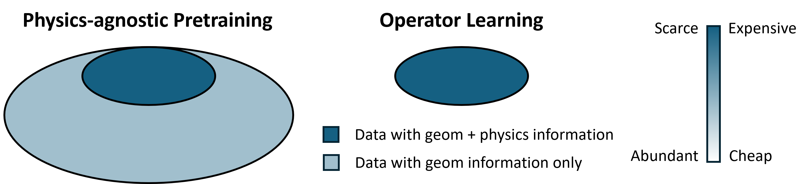
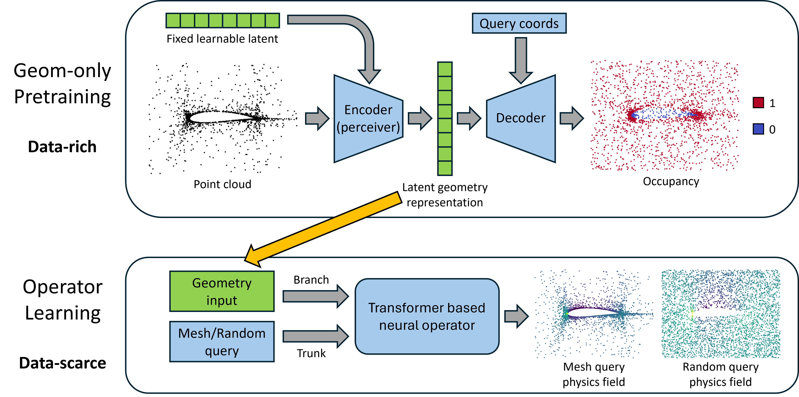

<div align="center">

<h1>From cheap geometry to expensive physics: A
physics-agnostic pretraining framework for neural operators</h1>

Zhizhou Zhang, Youjia Wu, Kaixuan Zhang, Yanjia Wang

Bosch (China) Investment Co., Ltd.

corresponding author: zhizhou.zhang@cn.bosch.com

Accepted to ICLR 2026!

Paper link:
[PHYSICS-AGNOSTIC PRETRAINING](https://openreview.net/forum?id=iCprPzyrRp)

</div>

## Table of Contents
- [Table of Contents](#table-of-contents)
- [Introduction](#introduction)
- [Method](#method)
- [Quantitative Results](#quantitative-results)
  - [Datasets:](#datasets)
- [Repo Introduction](#repo-introduction)
  - [Environment requirements](#environment-requirements)
  - [Train autoencoder:](#train-autoencoder)
  - [Train neural operators:](#train-neural-operators)
- [Related Works](#related-works)

## Introduction

Industrial design evaluation often relies on high-fidelity simulations of governing partial differential equations (PDEs). Operator learning has emerged as a promising surrogate for high-fidelity physical simulations, enabling fast prediction of partial differential equation (PDE) solutions. However, accuracy of neural operators is largely affected by the amount of training data. In practical industrial scenarios, there exists large collections of candidate geometries remain unsolved due to the high computation cost. These geometry-only samples contain no physical field labels and are therefore ignored in standard operator learning pipelines. In this work, we propose a general physics-agnostic pretraining framework to exploit this abundant geometric resource to improve the performance of neural operators.  Across four PDE datasets and three state-of-the-art transformer-based neural operators, our pretraining strategy consistently improves prediction accuracy. These results demonstrate that representations from physics-agnostic pretraining provide a powerful foundation for data-efficient operator learning.

<div align="center">

</div>

This visualization shows the difference in geometry-only data and PDE labeled data.

## Method

Existing pretraining techniques rely on fixed grid topology and are mostly physics-aware. By physics-aware, we refer to those autoregressive (or similar) tasks where the input fields are readily PDE solutions and contain physics information. On the other hand, there lacks research in leveraging fully physics-agnostic pretraining techniques for operator learning tasks.

<div align="center">

</div>

The visualization above illustrates the core methodology of our proposed physics-agnostic pretraining. In essence, we construct a physics-agnostic proxy task (e.g. occupancy field prediction) to train an encoder on a large corpse of geometry-only data. This encoder would enhance the performance of neural operators in downstream physical field prediction tasks when PDE labels are limited. The method is generally adaptable to problem with arbitrary mesh structures.

## Quantitative Results

### Datasets:
We provide four datasets: 2D Stress, 2D AirfRans, 3D Inductor, 2D Electrostatic. Each dataset contains the geometry point cloud, preprocessed occupancy field, and the PDE field from two different query methods. Please find more details in the manuscript.

**Note:** Datasets will be released soon.

The table below shows a performance ($10^{-2}$) comparison of SoA neural operators with and without our physics-agnostic pretraining stage. In most cases, a clear performance gain can be observed from the pretraining, which requires no PDE solutions but richer geometry-only datasets.

| Dataset                  | Query  |          GNOT |         G+VAE |         Trans |         T+VAE |           LNO |         L+VAE |
| ------------------------ | ------ | ------------: | ------------: | ------------: | ------------: | ------------: | ------------: |
| **Number of parameters** |        | **1.7–1.8 M** | **1.7–1.8 M** | **1.7–1.8 M** | **1.7–1.8 M** | **1.8–1.9 M** | **1.8–1.9 M** |
| Stress                   | Mesh   |           9.8 |       **9.0** |          11.5 |          11.2 |          26.5 |      **13.6** |
| Stress                   | Random |          10.3 |       **8.3** |          11.5 |       **9.7** |          20.0 |      **11.6** |
| AirfR (near)             | Mesh   |           6.8 |       **5.6** |          13.4 |          12.7 |          27.4 |          27.1 |
| AirfR (near)             | Random |           7.8 |       **5.9** |          15.0 |      **10.8** |          25.3 |      **10.0** |
| Inductor (3D)            | Mesh   |           7.0 |           7.1 |          11.4 |       **8.4** |          24.9 |       **9.2** |
| Inductor (3D)            | Random |          12.5 |      **11.8** |          16.8 |      **13.2** |          20.3 |      **13.0** |
| Electrostatics           | Mesh   |           4.2 |       **3.3** |           5.0 |       **3.8** |          13.5 |       **4.6** |
| Electrostatics           | Random |           4.6 |       **3.4** |           5.6 |       **3.9** |          13.5 |       **4.7** |


## Repo Introduction

### Environment requirements
```
pytorch, numpy, pyyml, einops, scipy
```

### Train autoencoder:
DDP is used for parallel training, so you can use 1 or more GPUs.

```
torchrun --nproc_per_node=2 main_ae.py --config Configs/VAE/Stress.yaml
```

Please update `--nproc_per_node`, `batch_size`, and `accum_iter` (gradient accumulation steps) in the config file according to your hardware setup.

### Train neural operators:
```
torchrun --nproc_per_node=1 main_no.py --config Configs/NO/Stress_GNOT.yaml
```
or
```
torchrun --nproc_per_node=1 main_no.py --config Configs/NO/Stress_VAE_GNOT.yaml
```

Please update `--nproc_per_node`, `batch_size`, and `accum_iter` (gradient accumulation steps) in the config file according to your hardware setup.

To use encoded latent embeddings as inputs for operator training, set `use_VAE: true` in the config file and provide the path to the pretrained autoencoder checkpoint via `vae_pth`.

Edit the `use_mesh` argument to change the query method.

## Related Works

The repo integrates pretrained encoders with the following transformer based neural operators:
- GNOT: from code implemented in `models/cgpt.py` — [GNOT paper](https://proceedings.mlr.press/v202/hao23c)
- Transolver: from code implemented in `models/Transolver.py` — [Transolver paper](https://arxiv.org/abs/2402.02366)
- LNO: from code implemented in `models/LNO.py` — [LNO paper](https://proceedings.neurips.cc/paper_files/paper/2024/hash/39f6d5c2e310a5a629dcfc4d517aa0d1-Abstract-Conference.html)